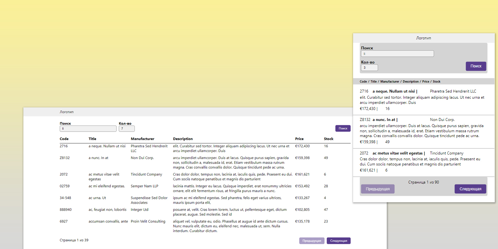

## Front

В проекте используется React.js и Typescript, стилизация с использованием SCSS (modules scss). Имеется стилизация под два типа экранов: до 600px и более, соответственно.

Данные поступают с API, загружаются в колличестве указанных в поле "Кол-во" (изначально 3 элемента на страницу). Дополнительно можно сделать поисковой запрос по названию, описанию, производителю в поле "Поиск".

Кроме того:
* Реализован лоадер во время подгрузки данных
* В случае ошибки пользователю показывается текст ошибки

### Дополнительно
* У приложение нет страницы авторизации. Логин/пароль указываются в настройках;
* Приложение имеет различные настройки для Development и Production сред (/config/config.development.ts и /config/config.production.ts);
* У страницы есть шаблон Layots, в частности можно не показывать Header, если showHeader установить в false или не указывать его.

### Установка
Для установки и запуска проекта выполните следующие шаги:

1. Склонируйте репозиторий на локальную машину:

    ```bash
    git clone https://github.com/maestros123/ever.git
    ```

2. Перейдите в директорию проекта:

    ```bash
    cd ever
    ```

3. Установите зависимости:

    ```bash
    npm install
    ```

4. Запустите проект:

    ```bash
    npm start
    ```